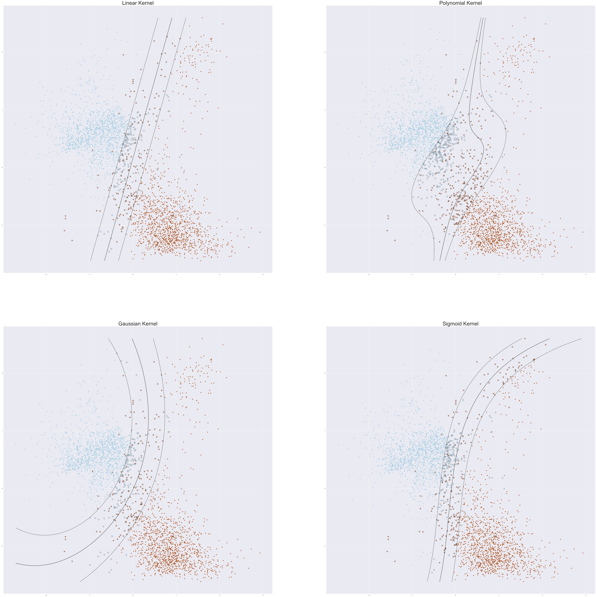

# Gender Recognition by Voice

This is the project for NTU course *SC1015 Introduction to Data Science and Artificial Intelligence*.

Our goal is to study the relationship between sound data and the gender of the speaker, and to attempt to estimate the gender of the speaker through various models.

The main page of our project is [here](https://pufanyi.github.io/GenderRecognitionByVoice).

## Content

All code is located under the src directory.

Please read through the code in the flowing sequence:

- [`DataPreparationAndExploration.ipynb`](./src/DataPreparationAndExploration.ipynb)
- [`GenderRecognitionUsingTreeBasedAlgorithms.ipynb`](./src/GenderRecognitionUsingTreeBasedAlgorithms.ipynb)
- [`GenderRecognitionUsingNumericalAlgorithms.ipynb`](./src/GenderRecognitionUsingNumericalAlgorithms.ipynb)
- [`SVMFurtherExploration.ipynb`](./src/SVMFurtherExploration.ipynb)
- [`PCAFurtherExploration.ipynb`](./src/PCAFurtherExploration.ipynb)

## Problem Definition

- How can we differentiate the gender of a speaker through their voice?
  - What are the key features to achieve this?
  - Which models can better predict the gender of a speaker?

## Highlight of Data preparation

### Remove Duplicate Data

We removed the `meanfreq` (mean frequency) and `centroid` (frequency centroid). They are the same in definition.

### Log Transformation

To prepare the input data, we applied a log transformation using the formula $x' = \ln(x+1)$, which helped to reduce the impact of extreme values and normalize the distribution of the data. This transformation reduced skewness, brought the data closer to normal distribution, and improved the accuracy of our model by reducing the influence of extreme values.

## Models Used

| Model | Training Accuracy | Testing Accuracy |
| --- | --- | --- |
| Classification Tree | 1.0000 | 0.9751 |
| Random Forest | 1.0000 | 0.9801 |
| Logistic Regression | 0.9763 | 0.9734 |
| K-Nearest Neighbors | 1.0000 | 0.9817 |

## Further Exploration

### Cross Validation

Previously, we employed a conventional train-test split to evaluate the performance of our gender classification model. In order to further improve the accuracy and efficiency of our algorithm, we will utilize CV to evaluate the model's generalization performance and reduce overfitting.

### Support Vector Machines

We still chose two previous variables. We used four types of models.The Gaussian kernel has the highest accuracy score of 0.968, followed by the Linear kernel with the accuracy score of 0.966. The other two, Polynomial kernel and Sigmoid kernel have the accuracy of 0.946 and 0.865.

## Group Members

| Name | GitHub Account | Email | Contribution |
| --- | --- | --- | --- |
| Pu Fanyi | [pufanyi](https://github.com/pufanyi) | FPU001@e.ntu.edu.sg | ??? |
| Jiang Jinyi | [Jinyi087](https://github.com/Jinyi087) | D220006@e.ntu.edu.sg | ??? |
| Shan Yi | [shanyi26](https://github.com/shanyi26) | SH005YI@e.ntu.edu.sg | ??? |